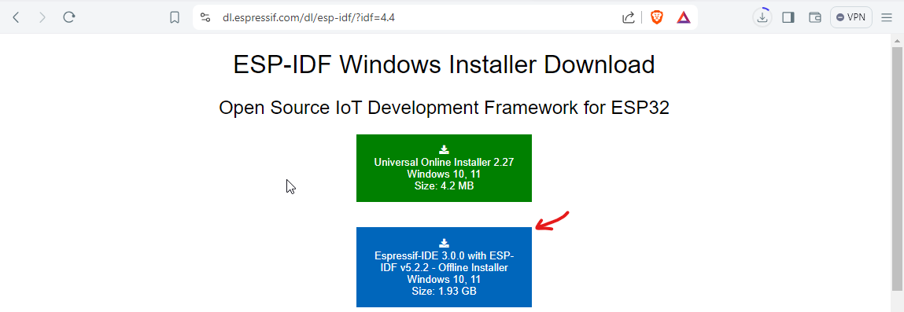

# ESP-IDF Installation and Usage Guide

## Official Documentation
Refer to the official documentation for detailed instructions:  
<div style={{ textAlign: 'center', marginTop: '30px' }}>
  <a href="https://docs.espressif.com/projects/esp-idf/en/stable/esp32c6/get-started/index.html" target="_blank">
    <button style={{ backgroundColor: '#0078D7', color: 'white', border: 'none', padding: '20px 20px', fontSize: '16px', borderRadius: '5px',   cursor: 'pointer' }}>
      ESP-IDF Official Documentation
    </button>
  </a>
</div>

<br></br>

## Installation

### Windows
- Use the full offline installer:  

    [ESP-IDF Offline Installer](https://dl.espressif.com/dl/esp-idf/?idf=4.4)

<div style={{ textAlign: 'center', marginTop: '30px' }}>

    

</div>

- Open the installer and select all available board options.

<div style={{ textAlign: 'center', marginTop: '30px' }}>


</div>

#### Creating and Configuring a Project - Espressif-IDE

1. Open the **Espressif-IDE**.

2. Create a new project example.

<div align="center">
  
     
</div>

3. Select the **ESP32-C6** board.

<div align="center">
  

</div>

4. Configure the project settings:
   - Set the clock speed to **40MHz**.
   - Set the flash memory to **4MB**.

5. Build the project.

<div align="center">
  

</div>

6. Flash the firmware to the board.


### GNU/Linux (Ubuntu)

#### Requirements
Ensure Python3 is installed:
```bash
python3 --version
```

Install the required dependencies:
```bash
sudo apt-get install git wget flex bison gperf python3 python3-pip python3-venv cmake ninja-build ccache libffi-dev libssl-dev dfu-util libusb-1.0-0
```

#### Setting Up the Environment
1. Create a directory for ESP-IDF:
     ```bash
     mkdir -p ~/esp
     cd ~/esp
     git clone -b v5.3 --recursive https://github.com/espressif/esp-idf.git
     ```

2. Install ESP32-C6 example:
     ```bash
     cd ~/esp/esp-idf
     ./install.sh esp32c6
     ```
:::note

     To develop for multiple boards:
     ```bash
     ./install.sh esp32,esp32s2
     ```

    You can also install all boards at once:

     ```bash
     ./install.sh all
     ```
:::

#### Configuring Environment Variables

Set up environment variables:
```bash
. $HOME/esp/esp-idf/export.sh
```

For frequent usage, create an alias:
```bash
alias get_idf='. $HOME/esp/esp-idf/export.sh'
```

---

## Creating and Configuring a Project

1. Copy the "hello_world" example:
     ```bash
     cd ~/esp
     cp -r $IDF_PATH/examples/get-started/hello_world .
     ```

2. Enter the project directory and configure the target board:
     ```bash
     cd ~/esp/hello_world
     idf.py set-target esp32c6
     idf.py menuconfig
     ```
    

     - Navigate to **Serial flasher config**.
     - Set clock speed to **40MHz** and flash memory to **4MB**.

     

3. Build the project:
     ```bash
     idf.py build 
     ```
4. Flash the firmware:
     ```bash
     idf.py -p /dev/ttyACM0 flash
     ```
  

## Uploading Firmware

1. Verify the device connection:
     ```bash
     lsusb
     dmesg | grep ttyACM*
     [ 6497.689351] cdc_acm 1-1:1.0: ttyACM0: USB ACM device
     ```

2. Flash the firmware:
     ```bash
     idf.py -p /dev/ttyACM0 flash
     ```
  

3. Confirm successful upload.

---

## Using WSL

1. Open a terminal (PowerShell in administrator mode is recommended).
2. Use `usbipd` to view connected USB devices and create a communication link.
3. Attach the device:
     ```bash
     usbipd attach --busid <bus-id>
     ```
4. Verify the device in your Linux console.

To unlink the device:
- Detach the device in PowerShell:
    ```bash
    usbipd detach --busid <bus-id>
    ```
- Unbind the device for Windows use:
    ```bash
    usbipd unbind --busid <bus-id>
    ```

---

## Additional Notes
- Always ensure the correct paths are used for your environment.
- Refer to the official documentation for troubleshooting and advanced configurations.
- For frequent commands, consider creating aliases to streamline your workflow.
- Use `idf.py` commands for building, flashing, and managing projects.

