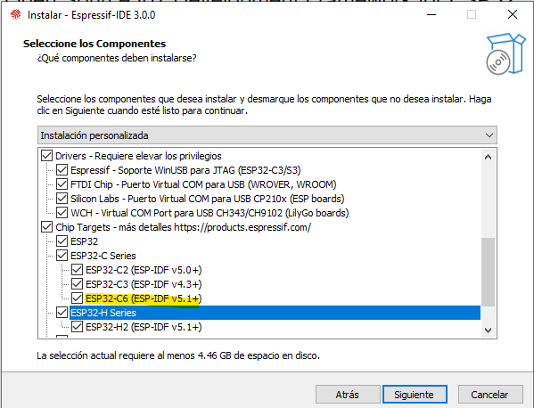
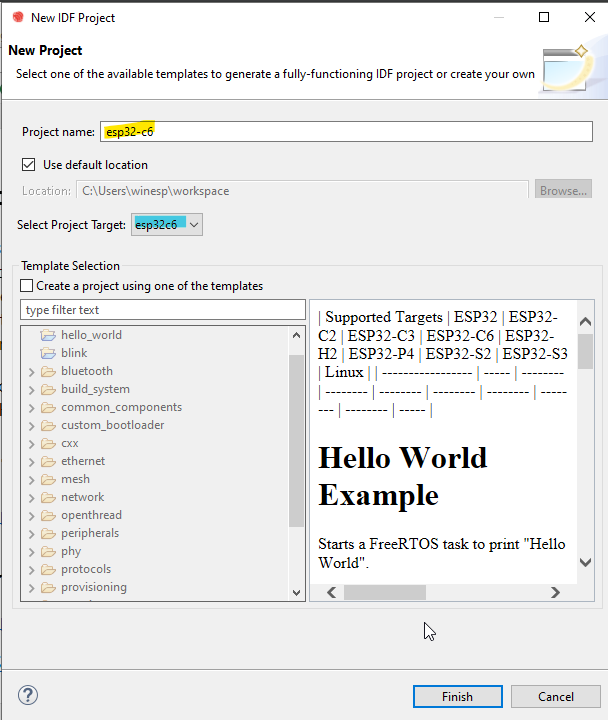

# Guía de Instalación y Uso de ESP-IDF

## Documentación Oficial
Consulta la documentación oficial para obtener instrucciones detalladas:  
<div style={{ textAlign: 'center', marginTop: '30px' }}>
     <a href="https://docs.espressif.com/projects/esp-idf/en/stable/esp32c6/get-started/index.html" target="_blank">
          <button style={{ backgroundColor: '#0078D7', color: 'white', border: 'none', padding: '20px 20px', fontSize: '16px', borderRadius: '5px',   cursor: 'pointer' }}>
               Documentación Oficial de ESP-IDF
          </button>
     </a>
</div>

<br></br>

## Instalación

### Windows
- Usa el instalador completo offline:  

          [Instalador Offline de ESP-IDF](https://dl.espressif.com/dl/esp-idf/?idf=4.4)

<div style={{ textAlign: 'center', marginTop: '30px' }}>

          

</div>

- Abre el instalador y selecciona todas las opciones de placas disponibles.

<div style={{ textAlign: 'center', marginTop: '30px' }}>



</div>

#### Creación y Configuración de un Proyecto - Espressif-IDE

1. Abre el **Espressif-IDE**.

2. Crea un nuevo proyecto de ejemplo.

<div align="center">
     
           
</div>

3. Selecciona la placa **ESP32-C6**.

<div align="center">
     

</div>

4. Configura los ajustes del proyecto:
      - Establece la velocidad del reloj en **40MHz**.
      - Establece la memoria flash en **4MB**.

5. Compila el proyecto.

<div align="center">
     

</div>

6. Flashea el firmware en la placa.


### GNU/Linux (Ubuntu)

#### Requisitos
Asegúrate de que Python3 esté instalado:
```bash
python3 --version
```

Instala las dependencias necesarias:
```bash
sudo apt-get install git wget flex bison gperf python3 python3-pip python3-venv cmake ninja-build ccache libffi-dev libssl-dev dfu-util libusb-1.0-0
```

#### Configuración del Entorno
1. Crea un directorio para ESP-IDF:
           ```bash
           mkdir -p ~/esp
           cd ~/esp
           git clone -b v5.3 --recursive https://github.com/espressif/esp-idf.git
           ```

2. Instala el ejemplo para ESP32-C6:
           ```bash
           cd ~/esp/esp-idf
           ./install.sh esp32c6
           ```
:::note

           Para desarrollar para múltiples placas:
           ```bash
           ./install.sh esp32,esp32s2
           ```

          También puedes instalar todas las placas a la vez:

           ```bash
           ./install.sh all
           ```
:::

#### Configuración de Variables de Entorno

Configura las variables de entorno:
```bash
. $HOME/esp/esp-idf/export.sh
```

Para un uso frecuente, crea un alias:
```bash
alias get_idf='. $HOME/esp/esp-idf/export.sh'
```

---

## Creación y Configuración de un Proyecto

1. Copia el ejemplo "hello_world":
           ```bash
           cd ~/esp
           cp -r $IDF_PATH/examples/get-started/hello_world .
           ```

2. Entra en el directorio del proyecto y configura la placa objetivo:
           ```bash
           cd ~/esp/hello_world
           idf.py set-target esp32c6
           idf.py menuconfig
           ```
          

           - Navega a **Serial flasher config**.
           - Establece la velocidad del reloj en **40MHz** y la memoria flash en **4MB**.

           

3. Compila el proyecto:
           ```bash
           idf.py build 
           ```
4. Flashea el firmware:
           ```bash
           idf.py -p /dev/ttyACM0 flash
           ```
     

## Subida de Firmware

1. Verifica la conexión del dispositivo:
           ```bash
           lsusb
           dmesg | grep ttyACM*
           [ 6497.689351] cdc_acm 1-1:1.0: ttyACM0: USB ACM device
           ```

2. Flashea el firmware:
           ```bash
           idf.py -p /dev/ttyACM0 flash
           ```
     

3. Confirma la subida exitosa.

---

## Uso de WSL

1. Abre una terminal (se recomienda PowerShell en modo administrador).
2. Usa `usbipd` para ver los dispositivos USB conectados y crear un enlace de comunicación.
3. Adjunta el dispositivo:
           ```bash
           usbipd attach --busid <bus-id>
           ```
4. Verifica el dispositivo en tu consola de Linux.

Para desvincular el dispositivo:
- Desconecta el dispositivo en PowerShell:
          ```bash
          usbipd detach --busid <bus-id>
          ```
- Desvincula el dispositivo para usarlo en Windows:
          ```bash
          usbipd unbind --busid <bus-id>
          ```

---

## Notas Adicionales
- Asegúrate siempre de usar las rutas correctas para tu entorno.
- Consulta la documentación oficial para solucionar problemas y configuraciones avanzadas.
- Para comandos frecuentes, considera crear alias para agilizar tu flujo de trabajo.
- Usa los comandos `idf.py` para compilar, flashear y gestionar proyectos.
